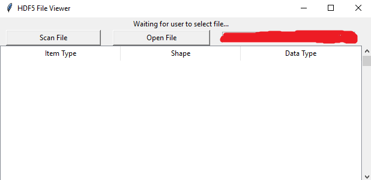
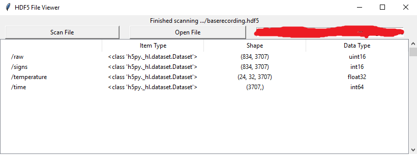

# hdf5viewer

A Tkinter GUI for quick viewing and inspection of the structure and contents of HDF5 files before opening them as part of a deeper analysis.

The idea is to use this to quickly check that a file can be opened and it is structured as inspected or open an unknwon file and quickly check the contents. This is to act as a quick inspection tool.

## Requirements
 - tkinter
 - matplotlib
 - h5py
 - Python 3.x (tested in 3.7.4, Windows 10)
 
## Features
 - Single file containing everything
 - Uses existing well documented tools
 - Simple interface for inspecting otherwise complex files.
 - File is only opened to update displayed metadata or to get next frame.
 
## How to run
Assuming you have all the requirements installed, start it using your favourite terminal

```bash
$ python3 hdf5viewer.py
```
## Known bugs
  - Slider index goes out of bounds generating an error message in the console
  - If the slider is dragged to the extreme and then back again it doesn't update properly. This is believed to be a bug in the matplotlib slider.
  
## How to Use

Start the script in your preferred manner.

Click Open File and select the target file. Only .hdf5 files are accepted.



If opened successfully, click Scan File and it will iterate over the file to collect information on the datasets it contains along with its datatype and size.



Double-click on a dataset to view it in a Matplotlib plot. If the dataset is 3D, use the matplotlib slider to iterate over the data in 2D slices. 


1D data is plotted as a line, 2D is plotted as a contourf, and 3D data is plotted as 2D slices with a slider to select the data index. Use the matplotlib controls to save the current state of the plot. You can have multiple plots open if you want, but that's not advised for ease of use and memory management.
